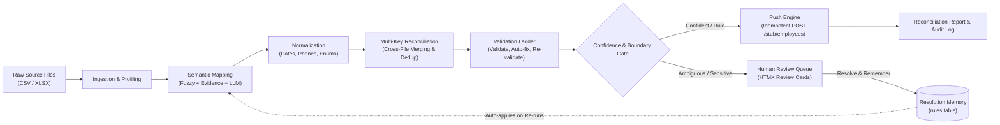

# DarwinSync AI: Autonomous Client Data Migration & Integration

[](https://www.python.org/downloads/)
[](https://fastapi.tiangolo.com)
[](https://sqlite.org)
[](https://htmx.org)
[](https://github.com/Anshik55/FDE/actions)
[](https://fde-production-dbcc.up.railway.app/)

An autonomous, event-sourced AI agent designed to ingest messy, multi-file client HR/CRM exports, perform semantic schema mapping and cross-source reconciliation, enforce strict validation ladders, and push to target APIs (such as Darwinbox) with idempotency, backoff retry, and compensating rollback.

Built for the **Darwinbox Forward Deployed Engineer (FDE)** take-home challenge.

---

## Key Differentiators & Highlights

1. **Defensible Autonomy Policy:** Grounded in a formal escalation boundary matrix ([DECISIONS.md](DECISIONS.md) & [WRITEUP.md](WRITEUP.md)). Automates verifiable, reversible, low-blast-radius operations; escalates high-blast-radius ambiguities (near-duplicates, sensitive data conflicts, ambiguous dates).
2. **Delta Solutioning & Resolution Memory:** Human decisions (mapping, enum resolution, date formats) are fingerprinted and persisted as client-scoped rules. On subsequent runs, escalations shrink by **-57%** (7 &rarr; 3 pre-push review cards on planted fixtures; 26 of 29 employees zero-touch).
3. **Append-Only Event Spine & Idempotency:** Every action carries `(before, after, reason, score, actor)`. Backed by SQLite database triggers prohibiting `UPDATE` and `DELETE` on the `events` table for an immutable audit log, with SHA256 target idempotency keys and offline prompt replay.
4. **Mock Target API (Darwinbox-shaped) with Fault Injection:** Includes `/stub/employees` with `Idempotency-Key` deduplication, 503 retry with exponential backoff, 422 unprocessable rejection, and batch outage compensating rollback.
5. **No-Build Reactive Web UI:** Built with FastAPI + Jinja2 + HTMX + Server-Sent Events (SSE) + Tailwind CSS CDN. Zero npm/node build steps required.

---

## Architecture



---

## Tech Stack

| Layer | Technology | Purpose |
|---|---|---|
| **Backend & API** | Python 3.11+, FastAPI, Uvicorn | High-performance asynchronous API & pipeline orchestrator |
| **Database & Events** | SQLite with WAL Mode & Append-Only Triggers | Stores raw source rows, events, escalations, rules, and canonical records |
| **Data Ingestion** | Pandas, Openpyxl | Robust CSV and Excel ingestion with type preservation |
| **Matching & Parsing** | RapidFuzz, python-dateutil, phonenumbers | High-speed string distance, candidate date detection, E.164 phone formatting |
| **Frontend UI** | Jinja2, HTMX, Server-Sent Events, Tailwind CDN | Zero-build real-time reactive UI with live pipeline event stream |
| **AI Runtime** | Ollama (`qwen2.5:7b-instruct` / `llama3.1:8b`) + SHA256 Replay Cache | Local LLM for semantic tie-breaking with zero external network dependency |

---

## Quick Start & Setup

### 1. Prerequisites
- Python 3.11 or higher
- Git
- (Optional for live LLM): [Ollama](https://ollama.com/) running with `ollama pull qwen2.5:7b-instruct`

### 2. Installation
```bash
# Clone the repository
git clone https://github.com/Anshik55/FDE.git
cd FDE

# Create and activate virtual environment
python3 -m venv .venv
source .venv/bin/activate

# Install dependencies
pip install -e .
```

### 3. Generate Test Fixtures
Pre-seeded, deterministic multi-file exports with planted edge cases:
```bash
python scripts/make_fixtures.py
```
This generates:
- `fixtures/hris_export.csv`
- `fixtures/payroll_export.xlsx`
- `fixtures/legacy_crm.csv`
- `fixtures/PLANTED_CASES.md` (documents all 11 planted cases)

### 4. Running the Web Application
```bash
# Start the FastAPI server with live reload
uvicorn app.main:app --host 0.0.0.0 --port 8000 --reload
```
Open your browser to: **[http://localhost:8000](http://localhost:8000)**

- **Run Monitor (`/`)**: Trigger runs, view live metrics, and watch the append-only event stream via SSE.
- **Review Queue (`/queue`)**: Inspect grouped escalation cards with side-by-side evidence, LLM proposals, and resolve with "Remember as rule".
- **Reconciliation Report (`/report`)**: Executive summary, autonomy scoreboard by stage, dropped columns, and source precedence conflicts.
- **Audit Trail (`/audit`)**: Filter events by actor (`AGENT`, `RULE`, `HUMAN`), view before $\rightarrow$ after diffs, and export CSV/JSON.
- **Learned Rules (`/rules`)**: Inspect and toggle client-scoped resolution memory rules.

### 5. Running via CLI Headless
```bash
python scripts/run_cli.py
```

---

## Running the Complete Test Suite

The test suite covers all 7 implementation phases and all 11 planted cases:

```bash
pytest tests/ -v
```

### Test Coverage Summary:
- `tests/test_phase0.py`: Contract schema validation and planted case fixtures verification.
- `tests/test_phase1.py`: Append-only event store triggers, pipeline ingestion, and stub API endpoints.
- `tests/test_phase2.py`: Multi-factor evidence mapping, Ollama replay cache, and sensitive mapping batching.
- `tests/test_phase3.py`: Casing/whitespace/phone normalization, multi-key reconciliation, and validation ladders.
- `tests/test_phase4.py`: Human resolution loop and resolution memory shrinking escalations on Run 2.
- `tests/test_phase5.py`: Push semantics: 503 exponential backoff retry, 422 parking, idempotency replay, and batch outage rollback.
- `tests/test_phase6.py`: Reconciliation report generation, audit trail filtering, CSV/JSON exports, and rule toggling.

---

## Deterministic LLM Replay Mode

To ensure reproducible test runs and offline evaluations without requiring an active Ollama daemon, the project includes committed SHA256 prompt responses in `llm_cache/`:

Set the environment variable or configure in `config.yaml`:
```bash
export LLM_MODE=replay
```
In replay mode:
1. Prompts are hashed via SHA256.
2. If present in cache, the exact cached JSON response is returned instantaneously.
3. If Ollama is unavailable or times out, the fail-safe boundary catches the error and surfaces an escalation card to the human supervisor without crashing.

---

## Planted Test Cases Verification

| # | Planted Case | Fixture | Behavior |
|---|---|---|---|
| 1 | Ambiguous `ref` column | `legacy_crm.csv` | **Escalates** (Top-2 candidates `employee_id` vs `manager_id` margin < 0.20) |
| 2 | Ambiguous DOJ dates ($\le$ 12) | `payroll_export.xlsx` | **Escalates** once per column (DD/MM vs MM/DD) |
| 3 | Exact duplicate employees | HRIS & Payroll | **Auto-merges** with corroborating details |
| 4 | Near-duplicate: "Rahul Sharma" vs "Rahul Sherma" (same DOB) | HRIS & CRM | **Escalates** (Irreversible identity risk) |
| 5 | Salary conflict for E1005 (₹80,000 vs ₹88,000) | HRIS & Payroll | **Escalates** (Sensitive field conflict) |
| 6 | Unknown status `"LOA"` | `hris_export.csv` | **Escalates as 1 group** with proposal $\rightarrow$ `"On Leave"` |
| 7 | Missing required email for E1030 | `hris_export.csv` | **Escalates** (Fails validation twice) |
| 8 | Missing email in HRIS present in CRM | HRIS & CRM | **Auto-fills** during reconciliation |
| 9 | Messy casing & phone formats | All files | **Auto-fixes** into clean E.164 and Title Case |
| 10 | Target API 503 and 422 | Push engine | 503 **silently retries**; 422 **parks and escalates** |
| 11 | Target system outage | Push engine | **Compensating rollback** deletes batch from target |

---

## Documentation

- [WRITEUP.md](WRITEUP.md): One-page take-home defense, boundary rationale, delta solutioning, and empirical metrics.
- [DECISIONS.md](DECISIONS.md): The formal escalation policy matrix and architecture decisions.
- [IMPLEMENTATION_PLAN.md](docs/IMPLEMENTATION_PLAN.md): Complete phase-by-phase implementation plan.
- [fixtures/PLANTED_CASES.md](fixtures/PLANTED_CASES.md): Planted test cases reference.
