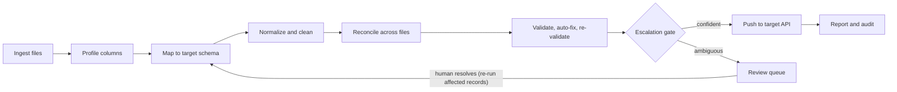

# Implementation Plan v2: AI Agent for Client Data Migration & Integration

**Assignment:** Darwinbox Forward Deployed Engineer take-home
**Time budget:** 4–6 focused hours. This plan targets about 6 h in total. The "Must" items (see §12) fit in about 4.5 h, and everything tagged Should/Could is a cut candidate.

---

## 0. Guiding principle

> **Auto-handle what is reversible, verifiable by code, and low-stakes. Escalate what is ambiguous, sensitive, or irreversible.**

Every design decision below should trace back to this sentence. It is also the one-liner for the 1-page write-up and the panel conversation.

The brief says it is testing **how the autonomy boundary is scoped**, not raw coding. So the plan spends its effort on three things:

1. A boundary that is *defensible* (not "everything" and not "nothing").
2. A UI that lets a non-technical consultant supervise without micromanaging.
3. A delta layer (criterion 6) that shows value beyond "AI does the pipeline".

### What changed from v1

| v1 | v2 | Why |
|---|---|---|
| Escalate when LLM confidence < 0.85 | Escalate on a **small margin between top-2 candidates**, scored by deterministic evidence | 8B-model self-reported confidence is poorly calibrated |
| LLM maps every column and normalizes job titles | Fuzzy matcher first; LLM only for leftovers; job titles get whitespace/casing fixes only | Faster, more reliable, and titles have no canonical list to verify against |
| Sensitive fields always escalate | Confirm the *mapping* once (batched, remembered), and escalate only *transformations* of values | Avoids the "escalate everything" failure the brief penalizes |
| Circuit breaker counts rows | Counts **escalation groups** (plus an affected-row ratio) | A dirty file with one repeated problem shouldn't trip it |
| UI in Phase 4 | Minimal UI in Phase 1 | The UI is what's evaluated, and it's the most likely thing to get squeezed |
| No delta layer | Resolution memory, reconciliation report, autonomy scoreboard | Criterion 6 |
| React or HTMX | HTMX + Jinja + SSE | No build pipeline |
| Rollback undefined | Idempotency keys, compensating deletes, 4xx vs 5xx handling | Criterion 5 |

---

## 1. Acceptance-criteria traceability

| # | Criterion | Where it is satisfied |
|---|---|---|
| 1 | Multi-file ingestion | Phase 1 (ingest + profile), Phase 3 (reconciliation into one dataset) |
| 2 | Autonomous mapping and cleanup | Phase 2 (mapping), Phase 3 (normalization) |
| 3 | Defensible escalation boundary | §5 escalation matrix, Phase 4 (policy engine, grouping, circuit breaker), `DECISIONS.md` |
| 4 | Human-in-the-loop UI | Phase 1 (skeleton), Phase 4 (queue + resolution), Phase 6 (audit, report, polish) |
| 5 | Mock integration, retry/rollback, audit trail | Phase 5 (push), event log from Phase 1 |
| 6 | Delta solutioning | Phase 4 (resolution memory), Phase 6 (reconciliation report, autonomy scoreboard), §11 stretch |

> **Interpretation to state in the write-up:** "Delta solutioning" = *value the FDE adds on top of what the AI does*. Here that is (a) the agent learns from every human decision so escalations shrink over time, (b) a reconciliation report a consultant can hand to the client, and (c) an autonomy scoreboard that shows the boundary working.

---

## 2. Architecture



### Design decisions

- **Event-sourced.** Every action is an append-only event. That gives a free audit trail, the live feed, and replayability. SQLite triggers reject `UPDATE`/`DELETE` on the `events` table.
- **Pipeline = pure function of `(source files, rules, human resolutions)`.** A human resolution is stored as an input (an override or rule), and the pipeline re-runs deterministically for the affected records. Stages emit an event only when a decision is *new or changed*, so re-runs don't spam the log.
- **Escalations don't block the run.** Only the affected columns/records wait. Everything else proceeds and can be pushed. This is what "without micromanaging" means in practice.
- **LLM boundary.** The LLM does two things only: (1) propose top-2 candidate mappings for columns the fuzzy matcher can't resolve, and (2) suggest a value for an unknown enum entry (shown on the escalation card as a *proposal*). It never validates, deduplicates, decides, or pushes.
- **Fail-safe direction.** If the LLM is unavailable, times out, or returns invalid JSON, the item **escalates**. It never guesses.
- **Evidence over self-reported confidence.** The score shown in the UI is computed by code from observable evidence (name similarity, type-parse rate, enum hit rate, pattern match, uniqueness, referential overlap), not the model's own number.
- **Local model = PII stays local.** Employee data never leaves the client's environment. This is a strong story for a customer-facing role.
- **Client-scoped memory.** Rules carry a `client_id` so learning never leaks between clients.

---

## 3. Technology stack

| Layer | Choice | Notes |
|---|---|---|
| Language / API | Python 3.11+, FastAPI, Uvicorn | Stub target API is mounted in the same app under `/stub` |
| Data handling | pandas, openpyxl | CSV + Excel ingestion |
| Fuzzy matching | rapidfuzz | Column names, enum synonyms, near-duplicate names |
| Parsing | python-dateutil (with explicit format candidates), phonenumbers | Date detection is per column, not per value |
| Store | SQLite (WAL mode) | Events, escalations, rules, records, push attempts, LLM cache |
| Live updates | Server-Sent Events | The endpoint tails the `events` table by `last_id`. No pub/sub needed |
| UI | Jinja2 + HTMX (+ SSE extension) + Tailwind (CDN) | Committed to HTMX. No build step |
| LLM | Ollama, `qwen2.5:7b-instruct` (or `llama3.1:8b`), temperature 0, JSON-schema `format` | Open-source, local |
| Tests | pytest | Deterministic core + a golden run on fixtures |

**Replay mode:** `LLM_MODE=replay` serves responses from a committed cache (`llm_cache`, keyed by prompt hash), so the demo is deterministic and reviewers can run it without a GPU. The README states this openly. `LLM_MODE=live` is the default when Ollama is reachable.

---

## 4. Data model

### 4.1 Target schema (`schema/target_employee.yaml`)

```yaml
entity: employee
fields:
  employee_id:       {type: string,  required: true,  identity: true, pattern: '^E\d{4}$'}
  first_name:        {type: string,  required: true}
  last_name:         {type: string,  required: true}
  email:             {type: email,   required: true,  identity: true}
  phone:             {type: phone}
  date_of_birth:     {type: date,    sensitive: true}
  hire_date:         {type: date,    required: true}
  department:        {type: enum,    required: true,
                      values: {Engineering: [eng, engg, tech], HR: [human resources, people ops],
                               Finance: [fin, accounts], Sales: [sales & marketing], Operations: [ops]}}
  job_title:         {type: string}                 # free text: whitespace/casing fixes only
  manager_id:        {type: string,  references: employee_id}
  employment_status: {type: enum,    required: true,
                      values: {Active: [active, act, current], Terminated: [terminated, resigned, exited],
                               "On Leave": [on leave, leave]}}   # NOTE: "LOA" deliberately absent
  salary:            {type: decimal, sensitive: true, min: 0}
```

Annotations: `required` (validation), `sensitive` (escalation policy), `identity` (used as match keys; structural changes escalate), `enum` (with a synonym map that acts as the first-pass normalizer).

### 4.2 SQLite tables

| Table | Purpose | Key columns |
|---|---|---|
| `runs` | One migration run | `id, client_id, status, started_at, finished_at, config_json` |
| `source_rows` | Raw ingested rows, untouched | `id, run_id, file, row_num, raw_json` |
| `events` (append-only) | Audit trail and live feed | `id, run_id, ts, stage, type, actor, entity_type, entity_id, field, before, after, reason, score, escalation_id, meta_json` |
| `escalations` | First-class review items | `id, run_id, group_key, type, status, context_json, proposal_json, affected_ids_json, created_at, resolved_at, resolved_by, resolution_json` |
| `rules` | Resolution memory | `id, client_id, kind, fingerprint, action_json, source_escalation_id, enabled, created_at, times_applied` |
| `canonical_records` | Reconciled output | `id, run_id, canonical_key, data_json, provenance_json, status` (`pending/ready/pushed/failed/rejected`) |
| `push_attempts` | Per-record push log | `id, run_id, record_id, idempotency_key, attempt, http_status, target_id, error, ts` |
| `llm_cache` | Deterministic replay | `prompt_hash, request_json, response_json, model, ts` |

**Event `actor`:** `agent | rule | human | system`. **Every event carries:** before, after, reason, score. That is the "what changed and why" requirement.

**Event types:** `RUN_STARTED, FILE_INGESTED, COLUMN_PROFILED, MAPPING_PROPOSED, MAPPING_ACCEPTED, LLM_CALLED, VALUE_NORMALIZED, DATE_FORMAT_RESOLVED, RECORDS_MERGED, CONFLICT_RESOLVED, AUTOFIX_APPLIED, VALIDATION_FAILED, ESCALATION_OPENED, HUMAN_RESOLVED, RULE_CREATED, RULE_APPLIED, PUSH_ATTEMPT, PUSH_SUCCEEDED, PUSH_RETRIED, PUSH_FAILED, BATCH_ROLLED_BACK, CIRCUIT_BREAKER_TRIPPED, RUN_COMPLETED`

### 4.3 Config defaults (`config.yaml`, all tunable)

```yaml
client_id: acme_corp
llm: {model: "qwen2.5:7b-instruct", temperature: 0, mode: live}    # live | replay
mapping: {auto_accept_score: 0.75, min_margin: 0.20}
fuzzy_dup: {name_similarity: 90, require_same_dob: true}
circuit_breaker: {max_escalation_groups: 20, max_escalated_row_ratio: 0.30}
push: {batch_size: 10, max_retries: 3, backoff_base_s: 0.5, outage_consecutive_failures: 3}
source_precedence: [hris_export, legacy_crm, payroll_export]       # for non-sensitive true conflicts
default_phone_region: IN
```

The numeric thresholds are starting values to be tuned against the fixtures. Say so in the write-up rather than presenting them as principled constants.

---

## 5. Escalation policy (the core of the submission)

### 5.1 Matrix

| Situation | Agent alone | Escalate | Reasoning |
|---|---|---|---|
| Whitespace, casing, phone format | Fix | – | Reversible and verifiable. Names are re-cased only if ALL-CAPS or all-lowercase (protects McDonald/O'Brien). |
| Date column where any value has day > 12 | Resolve the whole column as DD/MM | – | One unambiguous value proves the column format |
| Date column where every value is ≤ 12 | – | Yes, once per column | Genuinely ambiguous. A wrong guess silently corrupts data |
| Obvious column name match | Map | – | Score ≥ threshold and margin ≥ min_margin |
| Column that could map to two target fields | – | Yes | Top-2 margin too small |
| Source column with no plausible target | Drop and log | – | Source is retained, and the report lists dropped columns |
| Composite column (`Full Name`) | Split if 2 tokens | Only if ≥ 3 tokens **and** no other file supplies first/last | Reconciliation usually supplies the parts |
| Enum value matches synonym map or fuzzy ≥ 0.9 | Normalize | – | Verifiable against the enum |
| Enum value not recognized, no rule | – | Yes, with LLM proposal, then saved as a rule | Unverifiable. Human decides once |
| Exact duplicate (same key, no true conflict) | Merge | – | Reversible and verifiable |
| Null vs value across files | Value wins | – | Fills gaps and is logged |
| True conflict, non-sensitive field | Source precedence, logged | – | Low-stakes. Listed in the report for spot-check |
| True conflict, sensitive field (salary, DOB) | – | Yes | Wrong salary is high-stakes |
| Near-duplicate (similar name and same DOB, different key) | – | Yes | Merging different people is irreversible in the target |
| Structural ID change (add prefix, strip zeros) | – | Yes, once per pattern | Identity keys are load-bearing |
| Sensitive column mapping | – | **One batched "confirm sensitive mappings" card**, remembered | One-click approve, then never again |
| Validation fails → auto-fix → fails again | – | Yes | "Fails validation twice" made literal |
| Missing required field, fillable from another file | Fill | – | Reconciliation acts as an auto-fix |
| Push 5xx | Retry with exponential backoff | After max retries | Transient |
| Push 4xx | No retry | Yes | Target is telling us the data is wrong |
| Push outage (N consecutive exhausted retries) | Halt and roll back current batch | Yes (run-level) | Protects the target from partial writes |

### 5.2 Mapping decision procedure

1. **Candidate generation:** normalize the header (lowercase, strip punctuation), compare to target field names and aliases with rapidfuzz.
2. **Evidence scoring** per (column, target) pair, all deterministic:
   - name similarity
   - type-parse rate (share of values that parse as the target type)
   - enum hit rate
   - pattern match (e.g. `^E\d{4}$`)
   - uniqueness ratio (is it 1:1 per row?)
   - referential overlap with known ID sets
3. **Decision:**
   - top score ≥ `auto_accept_score` **and** margin over runner-up ≥ `min_margin` → auto-map.
   - Otherwise, if there is any plausible candidate → call the LLM (structured output: top-2 candidates + rationale), re-score the LLM's candidates with the same evidence, and re-apply the margin rule.
   - Still ambiguous → escalate with both candidates, side-by-side sample values, and the evidence.
4. **Sensitive targets** (`salary`, `date_of_birth`) collect into the single batched confirmation card.

### 5.3 Date decision procedure (per column)

1. Try candidate formats (`%d/%m/%Y`, `%m/%d/%Y`, `%Y-%m-%d`, `%d-%b-%Y`, and so on) against all non-null values. Keep the formats that parse **every** value.
2. Exactly one survivor → resolve it and log it.
3. Both DD/MM and MM/DD survive → ambiguous → escalate once for the column.
4. *(Should)* Before escalating, try **cross-file corroboration**: compare matched employees against an unambiguous file. If the column agrees with only one interpretation, resolve it automatically and log the evidence.

### 5.4 Grouping and circuit breaker

- Escalations have a `group_key = (type, source file, column, pattern signature)`. Forty rows with the same unknown status value produce **one card** with an "Apply to all 40" toggle.
- **Circuit breaker:** if open escalation *groups* exceed `max_escalation_groups`, or affected rows exceed `max_escalated_row_ratio`, the run halts and the *run itself* escalates ("this file looks structurally different from what I expected. Check before I continue").

### 5.5 Resolution semantics

| Action | Mapping card | Value card (enum/date) | Record card (dup/conflict/validation) |
|---|---|---|---|
| **Approve** | Accept proposed mapping | Accept proposed value/format | Accept proposed merge/value |
| **Correct** | Pick a different target field | Enter or choose a value | Edit the value, choose which source wins, or "not the same person" |
| **Reject** | Leave column unmapped | Set null (or exclude record if required) | Exclude the record from the push, with a logged reason |

Options on each card: **Apply to all similar** (default on for value/mapping cards) and **Remember as rule** (default on for mapping/enum/date, default off for record-level decisions).

---

## 6. Repository layout

```
migration-agent/
├── README.md
├── DECISIONS.md              # escalation matrix + rationale (§5)
├── WRITEUP.md                # 1-page write-up
├── IMPLEMENTATION_PLAN.md
├── config.yaml
├── requirements.txt
├── schema/target_employee.yaml
├── fixtures/                 # hris_export.csv, payroll_export.xlsx, legacy_crm.csv, PLANTED_CASES.md
├── llm_cache/                # committed replay cache
├── app/
│   ├── main.py               # FastAPI app, routes, SSE
│   ├── db.py                 # schema + append-only triggers
│   ├── events.py             # emit/tail
│   ├── config.py
│   ├── pipeline/
│   │   ├── orchestrator.py   # stage runner, idempotent re-run
│   │   ├── ingest.py
│   │   ├── profile.py
│   │   ├── mapping.py        # fuzzy + evidence scoring
│   │   ├── llm.py            # Ollama client, cache, replay
│   │   ├── normalize.py      # whitespace/case/phone/date/enum
│   │   ├── reconcile.py      # match keys, merge, conflicts, near-dups
│   │   ├── validate.py       # validate → autofix → revalidate
│   │   ├── escalation.py     # policy, grouping, circuit breaker
│   │   ├── rules.py          # resolution memory
│   │   ├── push.py           # retry/backoff/idempotency/rollback
│   │   └── report.py
│   ├── stub_target/api.py    # mock target with failure injection
│   └── web/                  # routes + templates/ + static/
├── scripts/
│   ├── make_fixtures.py      # seeded, deterministic
│   ├── run_cli.py
│   └── reset_db.py
└── tests/
```

---

## 7. Fixtures: planted cases

Three source files, roughly 30–40 rows each, about 70–80 unique employees after reconciliation. They are generated by a seeded script for bulk rows, plus hand-planted cases. **Each escalation type appears once or twice**, so the demo is deterministic.

| File | Format | Character |
|---|---|---|
| `hris_export.csv` | CSV | Headers like `Emp No, First Name, Last Name, E-mail, DOB, Join Date, Dept, Designation, Status, Mgr`. Dates DD/MM/YYYY (some days > 12). Messy whitespace and casing. |
| `payroll_export.xlsx` | Excel | `EmpID, Full Name, Email Address, Gross Salary, DOJ`. `DOJ` values are **all day ≤ 12**. Overlaps HRIS. |
| `legacy_crm.csv` | CSV | `name, mail, phone, birth_date, ref, status, dept`. ISO and `15-Mar-1988` dates. Inconsistent phone formats. |

| # | Planted case | Expected agent behavior |
|---|---|---|
| 1 | `ref` in CRM: all values unique and all match known employee IDs (could be `employee_id` **or** `manager_id`) | **Escalate** (mapping ambiguity) |
| 2 | Payroll `DOJ` all ≤ 12; HRIS `DOB` has days > 12 | `DOJ`: **escalate**. `DOB`: auto-resolve |
| 3 | Same person, same email in two files | Auto-merge |
| 4 | "Rahul Sharma" vs "Rahul Sherma", same DOB, different emails | **Escalate** (near-duplicate) |
| 5 | Same employee: salary differs between HRIS and payroll | **Escalate** (sensitive conflict) |
| 6 | Status value "LOA" (×2 rows) | **Escalate** as one group, with an LLM proposal |
| 7 | One row with no email anywhere (required) | Auto-fix fails → **escalate** |
| 8 | One row missing email in HRIS but present in CRM | Auto-filled by reconciliation |
| 9 | Whitespace, casing, phone-format noise | Auto-fixed (visible autonomy in the feed) |
| 10 | Stub: one 503 that succeeds on retry; one 422 (invalid department) | Retry succeeds silently. 422 → **escalate** |
| 11 | Stub: forced outage on a later batch | Batch **rolls back** |

**Expected run 1 cards:** mapping (1), sensitive-mappings (batched), date (1), enum (1), near-dup (1), salary conflict (1), missing email (1), push 422 (1) = **8 cards** over about 75 employees. Target: **>85% of rows fully auto-resolved**.
**Expected run 2 (with remembered rules):** about 4 cards (record-level only). That is the delta story.

---

## 8. Phases

### Phase 0: Contract, fixtures, decisions (~40 min)

**Goal:** everything downstream has something concrete to run against.

- [ ] Scaffold repo, venv, `requirements.txt`.
- [ ] Write `schema/target_employee.yaml` (§4.1) and a loader that validates it.
- [ ] Write `scripts/make_fixtures.py` (seeded). Generate the three files and `PLANTED_CASES.md` (§7).
- [ ] Draft `DECISIONS.md` from §5.1.
- [ ] Install Ollama, pull the model, and smoke-test a structured-output call. This is the single biggest environment risk, so do it now.

**Done when:** fixtures load in pandas, the planted-case table is committed, and an Ollama JSON call returns valid output.

### Phase 1: Thin end-to-end slice (~70 min)

**Goal:** one path through the whole system, ugly but alive.

- [ ] `db.py`: tables + append-only triggers on `events`.
- [ ] `events.py`: `emit(...)` and `tail(last_id)`.
- [ ] Ingest CSV/Excel into `source_rows`. Profile columns (type inference, null rate, sample values, uniqueness).
- [ ] Deterministic mapping via rapidfuzz on header names only. Basic whitespace/case normalization.
- [ ] **One hard-coded escalation** (e.g. the `ref` column) stored in `escalations`.
- [ ] Stub target: `POST /stub/employees`, happy path only. Push ready records.
- [ ] Minimal HTMX pages: Run screen with an SSE event feed, and a Queue page listing the single card with Approve.
- [ ] `scripts/run_cli.py` runs the pipeline headless.

**Done when:** clicking "Start run" streams events live, one card can be approved, and the records land in the stub.

### Phase 2: Mapping agent (~40 min)

**Goal:** criterion 2 for mapping. Fuzzy first, LLM for leftovers, evidence decides.

- [ ] `mapping.py`: candidate generation and the evidence-scoring functions (§5.2).
- [ ] `llm.py`: Ollama client with JSON-schema output, temperature 0, prompt-hash cache, `replay` mode, timeout and invalid-JSON handling (falls back to escalation).
- [ ] LLM prompt: column name, up to 10 sample values, target field descriptions → top-2 candidates + rationale.
- [ ] Re-score LLM candidates deterministically. Apply the margin rule.
- [ ] Batched **sensitive-mapping confirmation** card.
- [ ] Emit `MAPPING_PROPOSED / MAPPING_ACCEPTED / LLM_CALLED` with scores.

**Done when:** all obvious columns map without the LLM, `ref` escalates with both candidates and evidence, and killing Ollama degrades to escalation rather than a crash.

### Phase 3: Normalization, validation, reconciliation (~50 min)

**Goal:** criterion 1 ("one dataset") and the rest of criterion 2.

- [ ] `normalize.py`: trim/collapse whitespace, conservative name re-casing, lowercase emails, phone → E.164 (`default_phone_region`), enum synonym + fuzzy matching, per-column date resolution (§5.3), composite-name split.
- [ ] `reconcile.py`:
  - match key priority: employee ID → normalized email → name + DOB
  - exact-duplicate merge
  - null-vs-value fill
  - non-sensitive conflict via `source_precedence` (logged)
  - sensitive conflict → escalation
  - near-duplicate detection (rapidfuzz ≥ 90 on name **and** same DOB, different key) → escalation
  - keep per-field **provenance** (which file each value came from)
- [ ] `validate.py`: required fields, email format, hire_date ≥ DOB + 16 y and not in the future, salary numeric > 0, enum membership, manager_id exists in dataset. Implement **validate → auto-fix → re-validate → escalate**.

**Done when:** three files become one deduplicated dataset with provenance, and planted cases 2–9 behave as in §7.

### Phase 4: Escalation engine, resolution loop, resolution memory (~50 min)

**Goal:** criteria 3 and 6. Escalations become first-class objects that feed back into the pipeline.

- [ ] `escalation.py`: central policy function `should_escalate(situation) → (bool, reason)` used by every stage. It is the only place the boundary is encoded.
- [ ] Grouping by `group_key`. Circuit breaker on groups and row ratio.
- [ ] `POST /escalations/{id}/resolve` with `action`, `value`, `apply_to_group`, `remember`.
- [ ] On resolve: write a `HUMAN_RESOLVED` event, store the override (and a rule if `remember`), then **re-run only affected records** through the pipeline.
- [ ] `rules.py`: rule kinds `mapping`, `enum_value`, `date_format`, `sensitive_mapping_confirmed`. Each is fingerprinted (e.g. normalized header + sample-value signature), scoped by `client_id`, and applied before the escalation gate. Emit `RULE_APPLIED` and increment `times_applied`.
- [ ] Autonomy scoreboard queries: auto-resolved vs escalated, by stage.

**Done when:** resolving the "LOA" card with *remember* makes a second run escalate 0 status cards, and the second-run card count drops from about 8 to about 4.

### Phase 5: Push semantics (~40 min)

**Goal:** criterion 5.

- [ ] Stub API:
  - `POST /stub/employees`, honoring an `Idempotency-Key` header (a repeated key returns the original record with 200)
  - `GET /stub/employees`, `DELETE /stub/employees/{id}`
  - `POST /stub/admin/failure-config` for failure injection: 503-once for a given ID, 422 for a given ID, outage window for a given batch
- [ ] `push.py`:
  - idempotency key = `sha256(canonical_key + payload)`, so a retry never double-creates and a corrected payload gets a new key
  - process in batches of `batch_size`
  - **5xx / timeout:** retry up to `max_retries` with exponential backoff and jitter
  - **4xx:** no retry. Record the target's error message and open a `PUSH_REJECTED_4XX` escalation
  - **Outage:** `outage_consecutive_failures` consecutive exhausted retries → halt, **compensating `DELETE`s** for the current batch's created IDs (from `push_attempts`), emit `BATCH_ROLLED_BACK`, and open a run-level escalation
  - manual controls: **Retry failed** and **Rollback run** (deletes every ID created by the run)
- [ ] Log every attempt to `push_attempts` and the event log.

**Done when:** case 10 shows a silent retry success and a 422 card, case 11 rolls back cleanly, and re-pushing after a correction succeeds.

### Phase 6: UI completion + delta layer (~40 min)

**Goal:** criterion 4 polished, plus the delta pieces a consultant can show a client.

- [ ] **Live Run screen:** stage stepper, counters (rows in / auto-fixed / escalated / pushed / failed), autonomy bar ("X% auto-resolved, Y% escalated"), SSE feed with actor badges (agent / rule / human).
- [ ] **Review Queue:** cards readable in one glance. Each card has:
  - a plain-English question as the title ("Column `ref` in `legacy_crm.csv`: Employee ID or Manager ID?")
  - the evidence side by side (sample values, source file/column)
  - the agent's proposal, highlighted, plus the LLM rationale
  - impact ("affects 2 rows")
  - **Approve / Correct / Reject**, with *Apply to all similar* and *Remember* toggles
- [ ] **Audit Log:** filter by record, field, actor. Shows before → after, reason, and score. Export to CSV/JSON.
- [ ] **Reconciliation Report:** rows in → merged → pushed → rejected, each with a reason. Also lists dropped columns, source-precedence conflicts to spot-check, and per-record push status.
- [ ] **Rules page** (Could): list learned rules, enable/disable.

**Done when:** a non-technical person can run the demo end to end without instructions.

### Phase 7: Packaging and demo (~30 min)

- [ ] `README.md`: prerequisites (Python, Ollama + `ollama pull`), setup, `LLM_MODE=replay` instructions, tech stack, how to run tests.
- [ ] `WRITEUP.md` (1 page): approach, the guiding principle and matrix summary, the results (run 1 vs run 2 numbers), the delta interpretation, and what's next (§11).
- [ ] Record a 3–4 min demo (§10).
- [ ] Final check: fresh clone → README steps → working run.

---

## 9. Testing

| Test | Purpose |
|---|---|
| Date detector unit tests | Any day > 12 resolves the column. All ≤ 12 is ambiguous. Mixed formats are handled. |
| Mapping scorer unit tests | `ref` is ambiguous. Obvious headers auto-map. |
| Reconcile tests | Exact-merge, near-dup, and sensitive-conflict paths. |
| Validation loop test | Fails → auto-fix → fails → escalates. |
| Push tests against the stub | 503 retry, 422 no-retry, idempotent replay, batch rollback. |
| **Golden run** | Run on fixtures in replay mode and assert the exact set of expected escalation groups and counts. This guarantees the demo doesn't drift. |
| Fail-safe test | LLM unreachable → item escalates, no crash. |

---

## 10. Demo script (3–4 min)

1. **Start run.** Show stages ticking and the live feed. Point at auto-fixes (whitespace, DD/MM resolved from a day > 12, exact duplicate merged, missing email filled from another file).
2. **Autonomy bar.** "About 90% resolved without a human."
3. **Open the queue.** The consultant sees about 7 cards, not hundreds. Resolve:
   - the `ref` mapping (Correct → `employee_id`)
   - "LOA" (Approve the LLM's proposal, *Remember* on)
   - the near-duplicate ("not the same person")
   - the missing email (Correct)
4. **Pipeline resumes** for the affected records. Records flow to the push.
5. **Push.** A 503 retries silently. A 422 becomes a card. Fix it and re-push.
6. **Show the outage rollback** (or trigger *Rollback run*).
7. **Audit + report.** Open one record's before → after trail. Show the reconciliation report.
8. **Delta:** start run 2 and show escalations drop from about 8 to about 4 because of remembered rules.

---

## 11. Delta solutioning and "what I'd build next"

**Built (Must/Should):**
- Resolution memory (human decisions become client-scoped rules)
- Reconciliation report (the handoff artifact for the client)
- Autonomy scoreboard (makes the boundary visible)

**Stretch (Could), in priority order:**
1. **Cross-file date corroboration**, so fewer date escalations.
2. **Dry-run / pre-push preview**, showing exactly what will be created before anything is pushed.
3. **Export the learned mapping and rules as a reusable "migration playbook"** for the next client on the same source system. This is the repeatable-across-clients FDE angle.
4. **Confidence calibration:** track how often human decisions overturn the agent's auto-decisions, and tune thresholds from that data.
5. **Scale path:** Postgres, a job queue, chunked pushes, and per-tenant isolation.
6. **Role-based approvals** (e.g. salary conflicts need a second approver).
7. **Delta re-sync:** incremental migrations rather than only one-shot.

---

## 12. Priorities and cut list

| Tier | Items |
|---|---|
| **Must** (~4.5 h) | Phases 0–1; fuzzy + evidence mapping and escalation of `ref`; date-per-column; reconcile + exact merge + near-dup escalation; escalation resolve loop; push with retry/idempotency/4xx; live feed + queue UI; resolution memory for enums; README + write-up + demo |
| **Should** | LLM leftovers with replay cache; sensitive-mapping batched card; batch rollback on outage; reconciliation report; audit filters |
| **Could** | Rules management page; cross-file date corroboration; audit export; dry-run; composite-name split edge cases |

**If behind schedule, cut in this order:** Rules page → audit export → cross-file corroboration → outage rollback (keep manual *Rollback run*) → LLM (fall back to escalating leftovers; the boundary story still holds).

---

## 13. Risks and mitigations

| Risk | Mitigation |
|---|---|
| LLM gives flaky output | Temperature 0, JSON schema, cache + replay, invalid output → escalate |
| Evaluator has no GPU / no Ollama | `LLM_MODE=replay` with committed cache, documented in README |
| UI eats the time budget | Minimal UI exists from Phase 1. HTMX only. No custom components. |
| Boundary looks arbitrary | Every decision is in one policy function and the `DECISIONS.md` matrix, with a stated reason per row |
| Escalating too much | Grouping, remembered rules, sensitive-mapping batching, and the scoreboard to prove the ratio |
| Escalating too little | Sensitive conflicts, near-dups, and structural ID changes always escalate. Golden test locks this in. |
| Re-runs bloat the event log | Stages emit only new/changed decisions |
| Scope creep | §12 cut list is decided in advance |

---

## 14. Panel prep: questions to be ready for

- **Why not escalate below 0.85 LLM confidence?** Self-reported LLM confidence is poorly calibrated. I use evidence checks the code can verify and escalate on the margin between candidates.
- **Why is a date column ambiguous only sometimes?** One value with day > 12 proves the format for the column. If no value does, guessing silently corrupts data, so it escalates once per column.
- **What if the human is wrong?** Every resolution is an event with actor and reason, records can be re-run, and rules can be disabled. Push rollback uses compensating deletes.
- **Why is salary conflict escalated but department conflict not?** Salary is sensitive and high-stakes to get wrong. Department conflicts follow a documented source precedence and appear in the report for spot-check.
- **How does this scale?** Postgres, a job queue, batched pushes, per-tenant rule scopes. The event-sourced design carries over unchanged.
- **Why local models?** PII stays inside the client's environment, and the brief requires open-source models.
- **How do you know the boundary is right?** The first-run and second-run metrics, plus (next) tracking how often humans overturn auto-decisions.

---

## 15. Definition of done

- [ ] Three heterogeneous files ingest and reconcile into one dataset with no per-field instructions (**1**)
- [ ] Mapping and cleanup happen autonomously and are visible in the feed (**2**)
- [ ] Exactly the planted ambiguous cases escalate, grouped, and nothing else. This is asserted by the golden test (**3**)
- [ ] The UI shows the live run and the queue, and supports approve/correct/reject. At least one escalation is resolved on camera (**4**)
- [ ] Push reports per-record success/failure, retries 5xx, escalates 4xx, and rolls back on outage, with a full audit trail (**5**)
- [ ] Resolution memory, the reconciliation report, and the autonomy scoreboard are demonstrable (**6**)
- [ ] Repo, README, 1-page write-up, and demo recording are complete